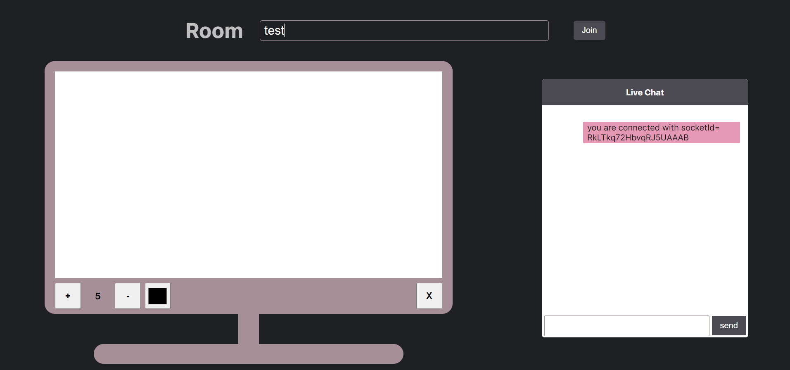
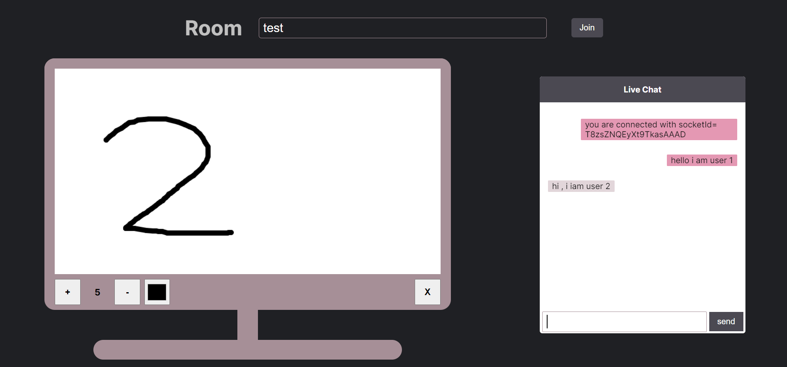
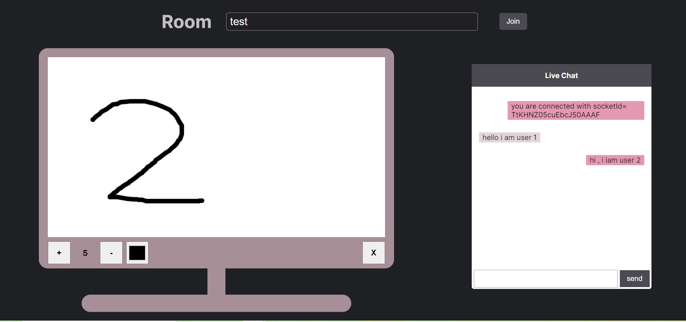

   
  
  
  

 

<h1> SketchNChat</h1>

This **webapp** is used to draw **free hand illustrations** as well as **chat** with friends in real time in private discussion rooms.
 
Use at : &nbsp; &nbsp; **https://sketch-n-chat.onrender.com/**
 

## ⚙ About

- It provides users with a platform to express their thoughts in a
  pictorial form as well as chat to resolve any ambiguity
- It provides users with gala time to enhance creativity and also a platform to organize discuusions.
- It allows users to create illustrations with variable size and with
  various different colours .
- It is equipped with the concept of rooms , therefore allows users to simulate private discussion rooms
- Any new creation can be started by simply clearing the previous one

 

## Process and Specifications

1. Open the Canvas Board Web Application
2. Join a Room by typing a suitable name for it.
3. Share the room name with your friends to create a private discussion group.
4. Select colour of your wish from the colour palette.
5. Choose the size of the drawing as your desire
6. Start Drawing.
7. Resize the drawing font and change the color anytime amid
   the creation.
8. Clear the illustration anytime.

 

## User Interface

- Initial Interface:

- Create/Join a Room and share with freinds/ colleagues

- User 1 Interface

- User 2 Interface

